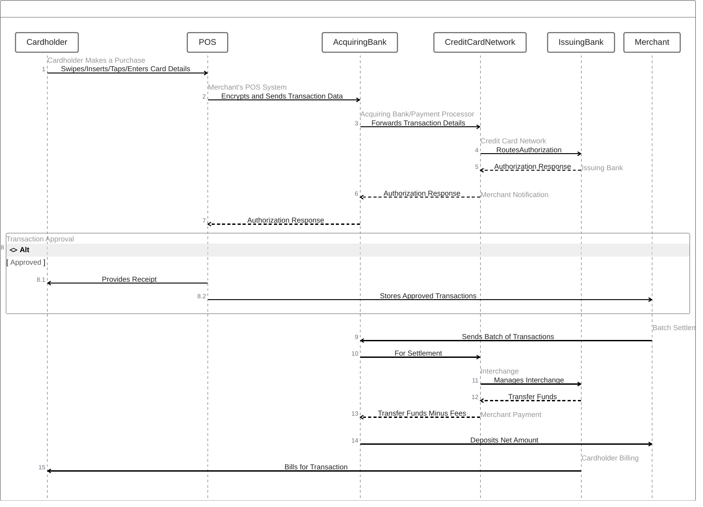

# Credit Card Transaction

```mermaid
zenuml
    @Cardholder "Cardholder"
    @POS "POS"
    @AcquiringBank "AcquiringBank"
    @CreditCardNetwork "CreditCardNetwork"
    @IssuingBank "IssuingBank"
    @Merchant "Merchant"

    // Cardholder Makes a Purchase
    "Cardholder" -> "POS": Swipes/Inserts/Taps/Enters Card Details

    // Merchant's POS System
    "POS" -> "AcquiringBank": Encrypts and Sends Transaction Data

    // Acquiring Bank/Payment Processor
    "AcquiringBank" -> "CreditCardNetwork": Forwards Transaction Details

    // Credit Card Network
    "CreditCardNetwork" -> "IssuingBank": RoutesAuthorization

    // Issuing Bank
    @return "IssuingBank" -> "CreditCardNetwork": Authorization Response

    // Merchant Notification
    @return "CreditCardNetwork" -> "AcquiringBank": Authorization Response

    @return "AcquiringBank" -> "POS": Authorization Response

    // Transaction Approval
    if(Approved) {
    "POS" -> "Cardholder": Provides Receipt
    "POS" -> "Merchant": Stores Approved Transactions
    }

    // Batch Settlement
    "Merchant" -> "AcquiringBank": Sends Batch of Transactions
    "AcquiringBank" -> "CreditCardNetwork": For Settlement

    // Interchange
    "CreditCardNetwork" -> "IssuingBank": Manages Interchange
    @return "IssuingBank" -> "CreditCardNetwork": Transfer Funds

    // Merchant Payment
    @return "CreditCardNetwork" -> "AcquiringBank": Transfer Funds Minus Fees
    "AcquiringBank" -> "Merchant": Deposits Net Amount

    // Cardholder Billing
    "IssuingBank" -> "Cardholder": Bills for Transaction

```