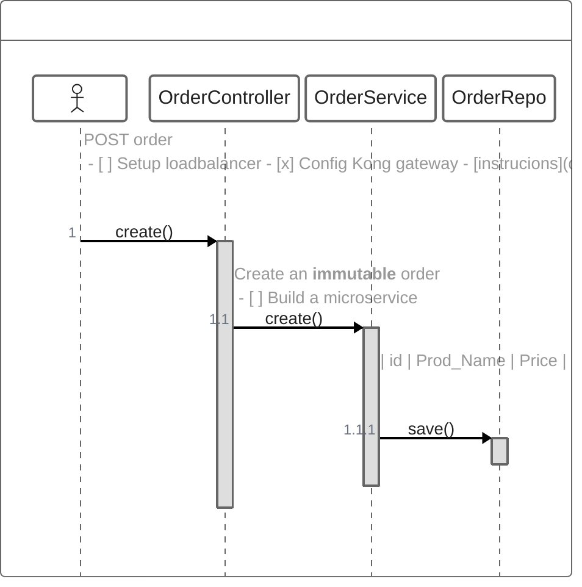

# Order Process

```mermaid
zenuml
    // `POST order`
    //
    // - [ ] Setup loadbalancer
    // - [x] Config Kong gateway - [instrucions](document)
    OrderController.create() {

    // Create an **immutable** order
    // - [ ] Build a microservice
    OrderService.create() {
        // | id | Prod_Name | Price | Inserted_At |
        // |----|-----------|-------|-------------|
        // |123 | book 1    | $10.00| 2020-06-30  |
        OrderRepo.save()
    }
    }
```