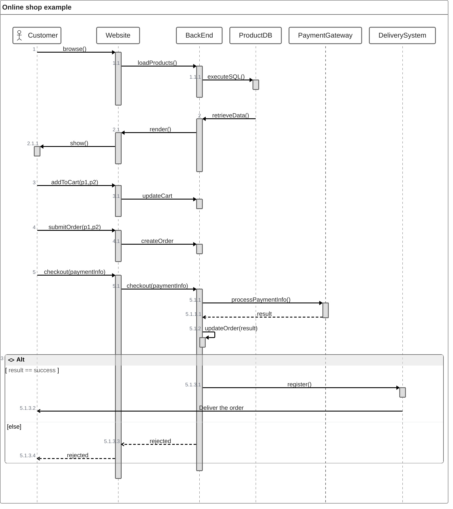

# Online Shop

")

```mermaid
zenuml
    title Online shop example
    @Actor Customer
    @AzureCDN Website
    @LogicApps BackEnd
    @CloudSQL ProductDB
    
    @DataProc PaymentGateway
    @AzureDataFactory DeliverySystem
    
    Customer->Website.browse() {
        BackEnd.loadProducts() {
            BackEnd->ProductDB.executeSQL()        
        }
    }
  

    ProductDB->BackEnd.retrieveData(){
        BackEnd->Website.render() {
            Website->Customer.show()
        }
    }

    

    Customer->Website.addToCart(p1, p2) {
    BackEnd.updateCart
    }
    Customer->Website.submitOrder(p1, p2) {
    BackEnd.createOrder
    }

    Customer->Website.checkout(paymentInfo) {
    BackEnd.checkout(paymentInfo) {
        result = PaymentGateway.processPaymentInfo()
        updateOrder(result)
        if (result == success) {
        DeliverySystem.register()

        DeliverySystem->Customer: Deliver the order
        } else {
        return rejected
        @return Website->Customer: rejected
        }
    }
    }

```
