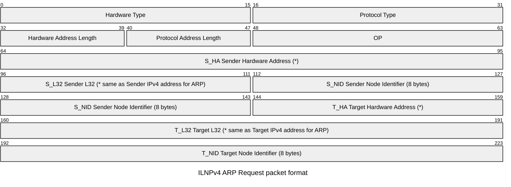

# ARP Address Resolution Protocol

[RFC 6747](https://datatracker.ietf.org/doc/html/rfc6747)

- HT Hardware Type (*)
- PT Protocol Type (*)
- HAL Hardware Address Length (*)
- PAL Protocol Address Length (uses new value 12)
- OP Operation Code (uses experimental value OP_EXP1=24)
- S_HA Sender Hardware Address (*)
- S_L32 Sender L32 (* same as Sender IPv4 address for ARP)
- S_NID Sender Node Identifier (8 bytes)
- T_HA Target Hardware Address (*)
- T_L32 Target L32 (* same as Target IPv4 address for ARP)
- T_NID Target Node Identifier (8 bytes)

