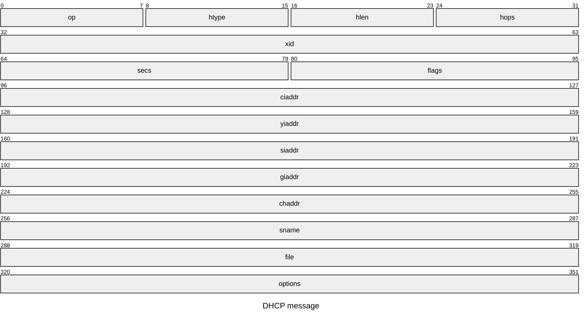
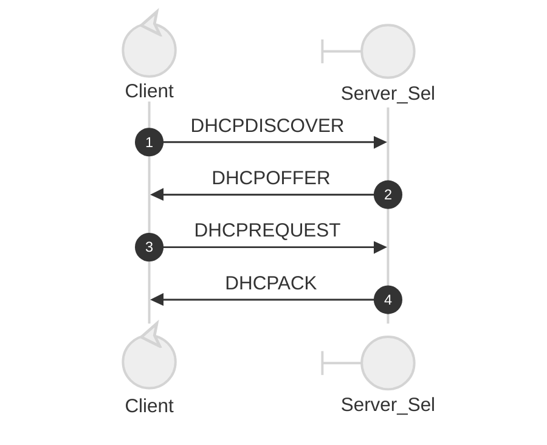

# Dynamic Host Configuration Protocol - DHCP

As descibed in RFC [RFC2131](https: "//datatracker.ietf.org/doc/html/rfc2131)

## DHCP Message format



### Message fields

```
FIELD      OCTETS       DESCRIPTION
   -----      ------       -----------

   op            1  Message op code / message type.
                    1 = BOOTREQUEST, 2 = BOOTREPLY
   htype         1  Hardware address type, see ARP section in "Assigned
                    Numbers" RFC; e.g., '1' = 10mb ethernet.
   hlen          1  Hardware address length (e.g.  '6' for 10mb
                    ethernet).
   hops          1  Client sets to zero, optionally used by relay agents
                    when booting via a relay agent.
   xid           4  Transaction ID, a random number chosen by the
                    client, used by the client and server to associate
                    messages and responses between a client and a
                    server.
   secs          2  Filled in by client, seconds elapsed since client
                    began address acquisition or renewal process.
   flags         2  Flags (see figure 2).
   ciaddr        4  Client IP address; only filled in if client is in
                    BOUND, RENEW or REBINDING state and can respond
                    to ARP requests.
   yiaddr        4  'your' (client) IP address.
   siaddr        4  IP address of next server to use in bootstrap;
                    returned in DHCPOFFER, DHCPACK by server.
   giaddr        4  Relay agent IP address, used in booting via a
                    relay agent.
   chaddr       16  Client hardware address.
   sname        64  Optional server host name, null terminated string.
   file        128  Boot file name, null terminated string; "generic"
                    name or null in DHCPDISCOVER, fully qualified
                    directory-path name in DHCPOFFER.
   options     var  Optional parameters field.  See the options
                    documents for a list of defined options.

```

### Client Server Timeline



Server          Client          Server
            (not selected)                    (selected)

DHCPDISCOVER -  Client broadcast to locate available servers.

   DHCPOFFER    -  Server to client in response to DHCPDISCOVER with
                   offer of configuration parameters.

   DHCPREQUEST  -  Client message to servers either (a) requesting
                   offered parameters from one server and implicitly
                   declining offers from all others, (b) confirming
                   correctness of previously allocated address after,
                   e.g., system reboot, or (c) extending the lease on a
                   particular network address.

   DHCPACK      -  Server to client with configuration parameters,
                   including committed network address.

   DHCPNAK      -  Server to client indicating client's notion of network
                   address is incorrect (e.g., client has moved to new
                   subnet) or client's lease as expired

   DHCPDECLINE  -  Client to server indicating network address is already
                   in use.

   DHCPRELEASE  -  Client to server relinquishing network address and
                   cancelling remaining lease.

   DHCPINFORM   -  Client to server, asking only for local configuration
                   parameters; client already has externally configured
                   network address.
