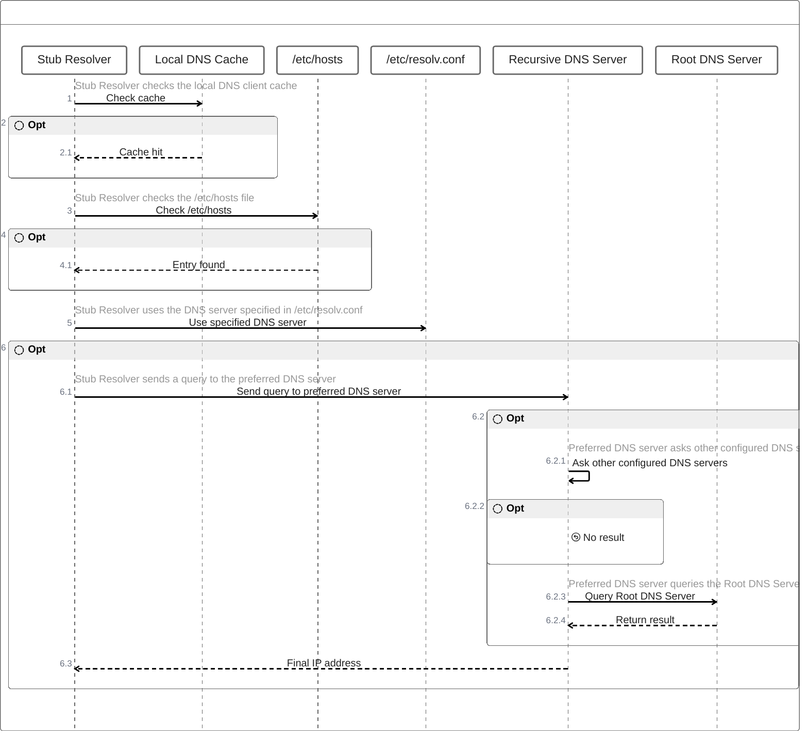

# DNS

```mermaid
zenuml
    @Client "Stub Resolver"
@Cache "Local DNS Cache"
@Hosts "/etc/hosts"
@Resolv "/etc/resolv.conf"
@Recursive "Recursive DNS Server"
@Root "Root DNS Server"

// Stub Resolver checks the local DNS client cache
"Stub Resolver" -> "Local DNS Cache": Check cache
opt{
  @return "Local DNS Cache" -> "Stub Resolver": Cache hit
}

// Stub Resolver checks the /etc/hosts file
"Stub Resolver" -> "/etc/hosts": Check /etc/hosts
opt{
  @return "/etc/hosts" -> "Stub Resolver": Entry found
}

// Stub Resolver uses the DNS server specified in /etc/resolv.conf
"Stub Resolver" -> "/etc/resolv.conf": Use specified DNS server
opt{
  // Stub Resolver sends a query to the preferred DNS server
  "Stub Resolver" -> "Recursive DNS Server": Send query to preferred DNS server
  opt{
    // Preferred DNS server asks other configured DNS servers in sequence
    "Recursive DNS Server" -> "Recursive DNS Server": Ask other configured DNS servers
    opt{
      @return "Recursive DNS Server" -> "Recursive DNS Server": No result
    }
    // Preferred DNS server queries the Root DNS Server
    "Recursive DNS Server" -> "Root DNS Server": Query Root DNS Server
    @return "Root DNS Server" -> "Recursive DNS Server": Return result
  }
  @return "Recursive DNS Server" -> "Stub Resolver": Final IP address
}
```