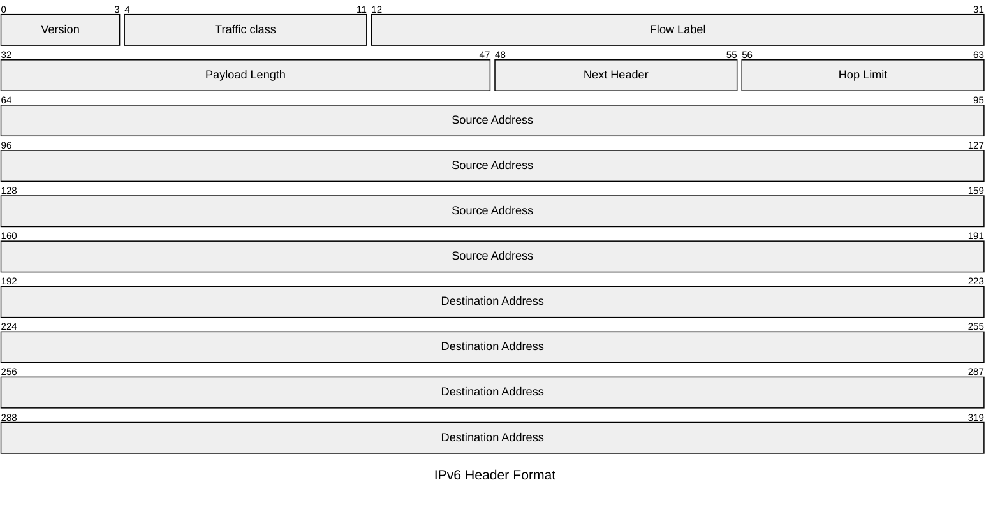
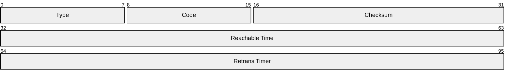

# Internet Protocol

This article is about **IP (*V.6*)** as descibed in [RFC 8200](https://datatracker.ietf.org/doc/html/rfc8200)

## Header

## Extension Header

Extension headers are numbered from IANA IP Protocol Numbers [IANA-PN](https://datatracker.ietf.org/doc/html/rfc8200#ref-IANA-PN)

## Options

### Router Advertisement Message Format

Routers send messages (<i>'Advertisements'</i>) periodically, or in response to <i>Router Solicitations</i>.

 ## Address stuff

 ### Neighbor Discovery Protocol

 As described in [Request for Comments: 4861 ](https://datatracker.ietf.org/doc/html/rfc4861) nodes on the same link use Neighbor Discovery to
   - determine each other's link-layer
   - addresses
   - find routers
   - maintain info on reachability 

#### Router Solicitation – Type 133