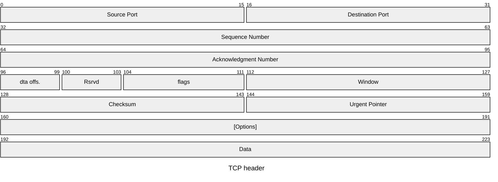
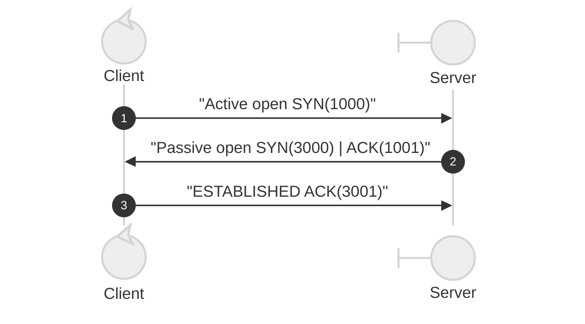

# Transmission Control Protocol - TCP 

[RFC 9293](https://datatracker.ietf.org/doc/html/rfc9293)

## Header format

```mermaid
---
title: "TCP header"
---
packet
+16: "Source Port"
+16: "Destination Port"
+32: "Sequence Number"
+32: "Acknowledgment Number"
+4: "dta offs."
+4: "Rsrvd"
+8: "flags"
+16: "Window"
+16: "Checksum"
+16: "Urgent Pointer"
+32: "[Options]"
+32: "Data"
```

## 3-Way Handshake

```mermaid
---
config:
  look: handDrawn
  theme: neutral
---
sequenceDiagram
autonumber
    
    participant Client@{ "type" : "control" }
    participant Server@{ "type" : "boundary"}
    Client->>Server: "Active open SYN(1000)"
    Server->>Client: "Passive open SYN(3000) | ACK(1001)"
    Client->>Server: "ESTABLISHED ACK(3001)"
```
