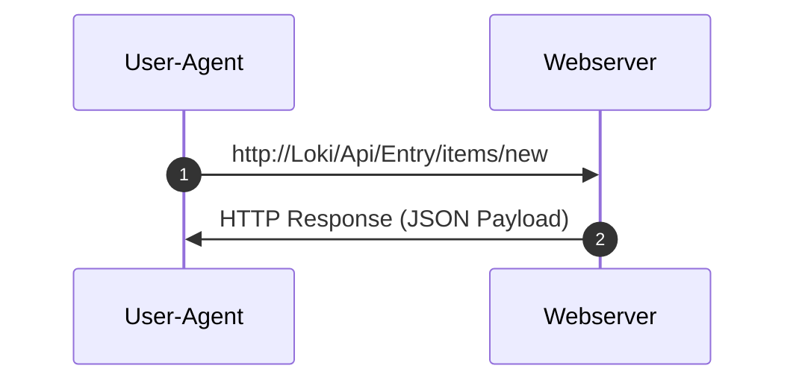

# HTTP 

## Client-Server Model

- HTTP follows the [client-server model](../client_server_model.md). In HTTP context a <var>request</var> and a <var>response</var> are being called <var>message</var>
- HTTP <var>request</var>s ate using <var>[methods](#_methods)</var> (some times called „verbs“)
- HTTP can be used by <var>TCP</var> or <var>UDP</var>
- HTTP communication is <var>stateless</var>




### Explanation:
<dl>
 <dt>User-Agent:</dt> <dd>HTTP Client - e.g: Web browser, cli tools like <kbd>cUrl</kbd>, <kbd>wget</kbd>, <kbd>lynx</kbd> etc.</dd>
 <dt>Webserver: </dt> <dd>HTTP Server (aka <var>Web server</var>) e.g: <kbd>nginx</kbd>, <kbd>Apache</kbd>, and alos Application servers like <kbd>JBoss</kbd>, <kbd>Tomcat</kbd> etc.
<dl>

## Communication
Assuming, the host name <var>Loki</var> will (lacally) be resolved to (Legacy) IP address <kbd>192.168.2.23</kbd>

- HTTP <var>Connect</var> to <kbd>Loki</kbd> (IP:```192.168.2.23```) @ port ```80``` (default) or:


- HTTP<b>S</b> <var>connect</var> to <kbd>Loki</kbd> (IP:```192.168.2.23```) @ port ```443``` (default  ```TCP```) or:
- HTTP<b>S</b> <var>connect</var> to <kbd>Loki</kbd> (IP:```192.168.2.23```) @ port ```488``` (default  ```UDP```) or:

- HTTP(S)<var>connect</var>to <kbd>Loki:4711</kbd> (IP:```192.168.2.23```) @ port <b>```4711```</b> (or any other)


## HTTP Request Message ()
Top: Header line(s)

<kbd title="Carriage Return">CR</kbd>+<kbd title="LineFeed">LF</kbd>+<kbd title="Carriage Return">CR</kbd>+<kbd title="LineFeed">LF</kbd> aka ```\r\n\r\n```

Bottom: <var>Payload</var>


```
POST /Loki/Api/Entry/items/new HTTP/1.1
Host: Loki
User-Agent: MyPyUA/0.2342666
Accept: application/json
Content-type: application/x-www-form-urlencoded
Content-length: 33
Connection: close
```
```      
Name=Pan+Pever&Location=N3v3ᴙL@nD
```


## HTTP Response Header

Top: Header line(s)
<kbd title="Carriage Return">CR</kbd>+<kbd title="LineFeed">LF</kbd>+<kbd title="Carriage Return">CR</kbd>+<kbd title="LineFeed">LF</kbd> aka ```\r\n\r\n```
Bottom: <var>Payload</var>

```
HTTP/1.1 201 Created
Location: http://Loki/Api/Entry/items/new
Cache-Control: no-cache
Server: Pythonista Club DE-47445 aka Ütfor(t)
Date: Wed Jul 4 15:31:53 2012
Connection: Keep-Alive
Content-Type: application/json;charset=UTF-8
Content-Length: 115
```
```json
{
	"NewEntry":	{
		"AffectedRows": 1,  
		"NewID": "23425%3F00B@ᴙ",
		"LogUri": "http://Loki/Api/Entry/log/foo
	}
}
```
## HTTP Message (schematical)

```
{STATUS LINE}
{HEADER_001}: VALUE 1
{HEADER_002}: VALUE 2
    ...
{HEADER_00{N}}: VALUE N    
```
```
{PAYLOAD}
```

## HTTP Request Message (schematical)

```
{METHOD} /REL_PATH_URI/FOO HTTP/{VERSION}
{HEADER_001}: VALUE 1
    ...
{HEADER_00{N}}: VALUE N    
```
```
{PAYLOAD} <opt>
```

## HTTP Response Message (schematical)

```
{METHOD} /REL_PATH_URI/FOO HTTP/{VERSION}
{HEADER_001}: VALUE 1
    ...
{HEADER_00{N}}: VALUE N    
```
```
{PAYLOAD} <opt>
```

### <a name="_methods">Methods</a>

#### GET:
Used to request data from a server. It's considered a safe and idempotent method, meaning it should not modify the server's state and repeated requests have the same effect as one. 
#### POST:
Used to send data to the server, typically to create a new resource or submit data from a form. 
#### PUT:
Used to replace an entire resource with a new representation. If the resource doesn't exist, it can be created. 
#### PATCH:
Used to apply partial modifications to an existing resource. 
#### DELETE:
Used to delete a resource on the server. 
#### HEAD:
Similar to GET, but only returns the HTTP headers without the body of the response. 
#### OPTIONS:
Used to inquire about the communication options available for a particular URL or server, such as which HTTP methods are supported. 
#### CONNECT:
Used to establish a tunnel to a server through an HTTP proxy, often used for establishing secure connections (HTTPS). 
#### TRACE:
Used to echo the request message back to the client, allowing for debugging purposes. 


[^1]: hier: synonym für HTTP und HTTPs

### Appendix:

The <var>HTTP Content-Length</var> header indicates the size, in bytes, of the message body sent to the recipient.
SEE: https://developer.mozilla.org/en-US/docs/Web/HTTP/Reference/Headers/Content-Length