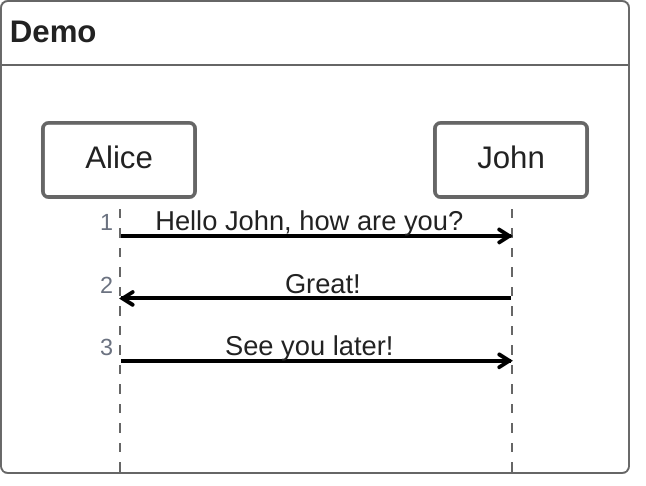

# Design Pattern: Creator

## Class diagram

<b>Creator</b> is a <i>creational</i> design pattern
- constructing complex objects
- producing different types and representations
- using a base construction code

## Implementations

### Java

### PHP

### Python 
