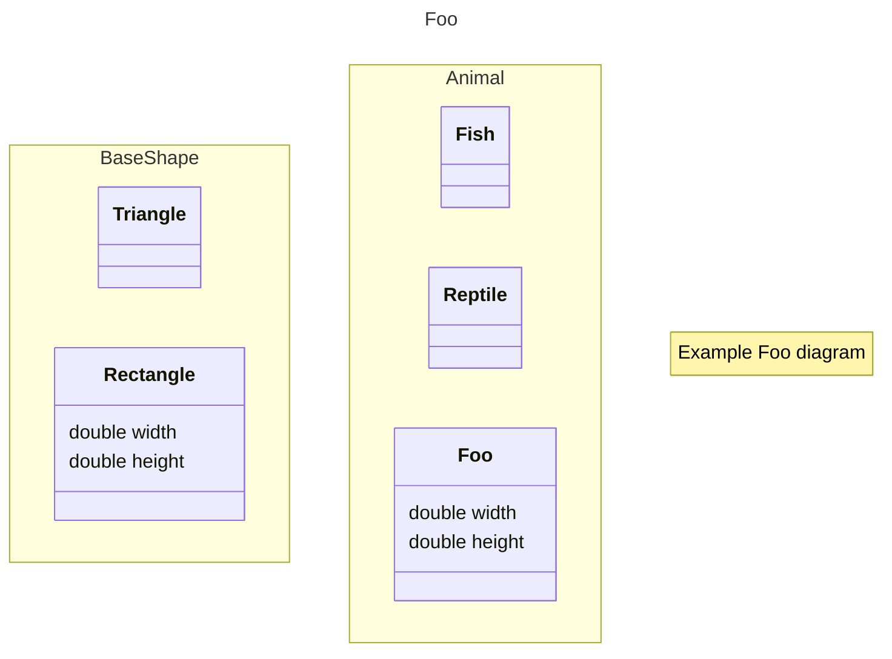

# Design Pattern: Foo

```mermaid

---
title: Foo
---
classDiagram
    note "Example Foo diagram"
namespace BaseShape {
    class Triangle
    class Rectangle {
      double width
      double height
    }
}

namespace Animal {
    class Fish
    class Reptile
    class Foo {
      double width
      double height
    }
}
```

## Implementations

### Java

### PHP

### Python 
