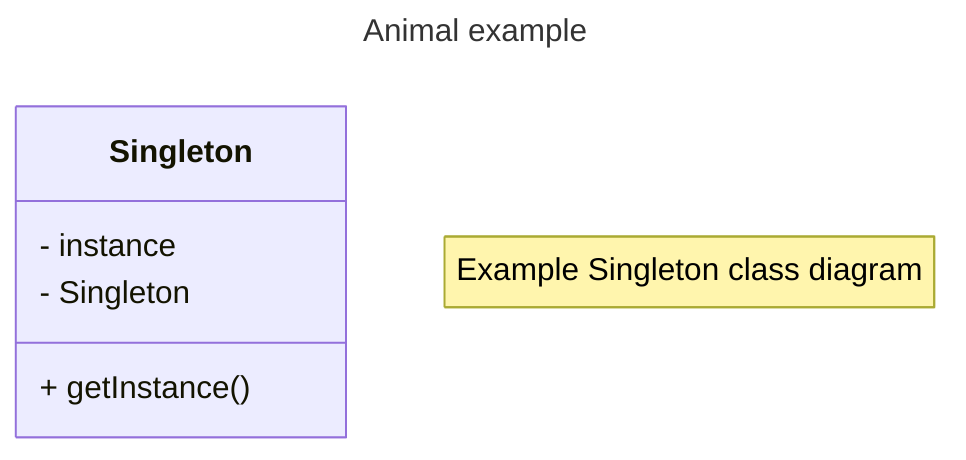

# Design Pattern: singleton

## Class diagram

<b>Singleton</b> is a <i>creational</i> design pattern
- ensuring, there is only one instance, while 
- providing a global access point to this instance.




## Implementations


### Java

```java
public final class Singleton {

    private static Singleton INSTANCE;

    /**
     * Its constructor MUST not be public
     * Let it be private - we do not like inheritance in this example
     */
    private Singleton() {        
    }
    
    /**
     * Static method for instancing 
     */
    public static Singleton getInstance() {
        if(INSTANCE == null) {
            INSTANCE = new Singleton();
        }
        
        return INSTANCE;
    }
}
```

### PHP

```php
class Singleton
{
    private static $instance = null;

    /**
     * Its constructor MUST not be public
     * Let it be private - we do not like inheritance in this example
     */
    protected function __construct()
    {
    }

    /**
     * Static method for instancing 
     */
    public static function getInstance(): self
    {
        
        if (!is_null(self::$instance)) {
            self::$instance = new self();
        }
        return self::$instance;
    }

    /**
     * Let's prohibit clonage
     */
    protected function __clone(): void
    {}
}
```

### Python 


```python
class Singleton(object):
    _instance = None
    def __new__(class_, *args, **kwargs):
        if not isinstance(class_._instance, class_):
            class_._instance = object.__new__(class_, *args, **kwargs)
        return class_._instance

class MyImpl(Singleton, BaseClass):
    pass
```